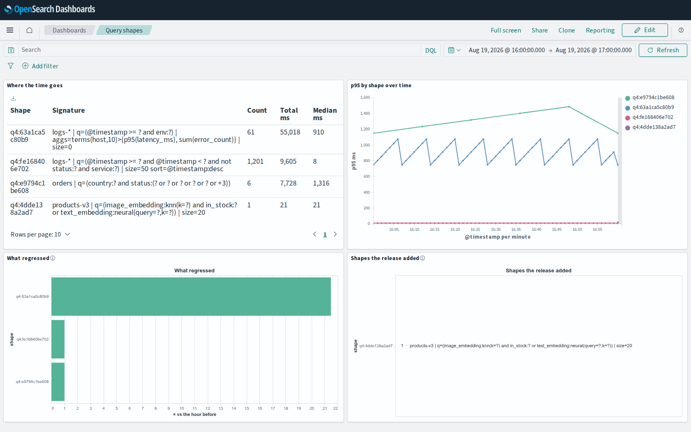

# The dashboard pack

Everything on the [Use cases](../use-cases/index.md) pages is a query you paste
into the console. This is the same four questions as a dashboard you import
once.

```bash
# 1. the mapping, so os.hash aggregates instead of falling apart into words
curl -XPUT localhost:9200/_index_template/os-query-digest \
     -H 'Content-Type: application/json' \
     --data-binary @resources/dashboards/index-template.json

# 2. the dashboard — pick the file that matches your Dashboards major
curl -XPOST localhost:5601/api/saved_objects/_import?overwrite=true \
     -H 'osd-xsrf: true' \
     --form file=@resources/dashboards/os-query-digest-opensearch-2.x.ndjson
```



Both files live in
[`resources/dashboards/`](https://github.com/mrDlef/php-os-query-digest/tree/main/resources/dashboards)
in the package you already installed, so `vendor/mr-dlef/os-query-digest/resources/dashboards/`
is the path on a real project.

!!! warning "Two files, and it is not a mistake"
    Dashboards **2.x bundles vega-lite 4** and **3.x bundles vega-lite 6**, and
    the plugin refuses a specification whose `$schema` names the other one. The
    two packs are generated from the same source and differ in that URL and in
    nothing else — a test asserts exactly that, so neither can quietly become a
    fork of the other.

## What you get

| Panel | The question | How |
|---|---|---|
| **Where the time goes** | which shape costs the cluster most | `terms` on `os.hash`, ordered by `sum(took)` |
| **p95 by shape over time** | when a shape got slow | `date_histogram`, split by shape |
| **What regressed** | which shape got worse, against itself | `bucket_script` over two windows |
| **Shapes the release added** | what is new since an hour ago | `bucket_selector` on an empty before-window |

No panel reads `os.q`. All four group on `os.hash` and label with `os.sig`, so
the pack works unchanged under
[`withText(false)`](logging.md#when-the-values-may-not-leave-the-building) — the
field is then simply absent from the records, and it appears in the pack only in
the index pattern's field list.

The first two are ordinary visualisations: open them, change the field, add a
metric. **The last two are Vega**, and not for decoration — they ask their
question with `bucket_script`, `bucket_selector` and `bucket_sort`, and no
classic visualisation can express a pipeline aggregation. Their specification
carries the aggregation from the page that explains it.

## The one thing to change

The pack ships an index pattern named `app-logs-*`. If your log index is called
something else, edit `index_patterns` in the template and the index pattern's
title in Dashboards — or rename the two before importing:

```bash
sed -i 's/app-logs-\*/my-logs-*/' resources/dashboards/*
```

The second thing you may want to change is the comparison window. *What
regressed* and *Shapes the release added* compare the selected range against the
same range **one hour earlier** — the incident question. That is the `shift` and
`unit` pair in each Vega specification; a deploy you want to judge against
yesterday wants `"shift": 1, "unit": "day"`.

## What is verified

The pack is generated from the Use cases pages by `make dashboards`, and the
suite fails if what is committed is not what the generator writes today. On top
of that:

- **the aggregation each Vega panel sends is executed** against live OpenSearch
  2.19.6 and 3.8.0 nodes, on the scenario those pages describe, and has to come
  back with the shape the page says it should;
- **the shipped index template is applied by a real cluster**, and `os.hash` is
  checked to come out a `keyword`;
- every field the pack names is checked against that template *and* against
  what the digest actually emits, so a panel cannot aggregate on a field this
  library stopped producing;
- no panel carries a fixed date: they follow the time picker;
- **the pack is imported into a real Dashboards of each major and opened in a
  browser** — `make dashboards-check` — where all four panels have to render,
  with data in them and no message in any of them. The screenshot above is the
  output of that run, not a picture taken once and left to rot.

That last one is the check that earned its keep. Every one of these was in the
pack and invisible until a browser opened it:

| What was wrong | What it looked like |
|---|---|
| a panel with no `version` | the whole dashboard app throws before drawing |
| a search source with no `indexRefName` | *Trying to initialize aggs without index pattern* |
| no field list on the index pattern | fine on 2.x, *Could not locate that index-pattern-field* on 3.x |
| `%context%` beside a body query | *must not be used when url.body.query is set* |
| `%dashboard_context-*%` written as objects | `Bad Request` from the cluster |
| `%timefilter%` with `shift: 1` | compares the window with the hour **after** it, so nothing ever regressed |
| a nested value addressed as `slowdown.value` | an axis of `[Infinity, -Infinity]`, or bars normalised to 1 |

**Not everything is machine-checked even so.** The check asserts that panels
render, carry data and report nothing; whether a chart is *readable* — labels
not clipped, colours legible — is still a thing to look at yourself.
